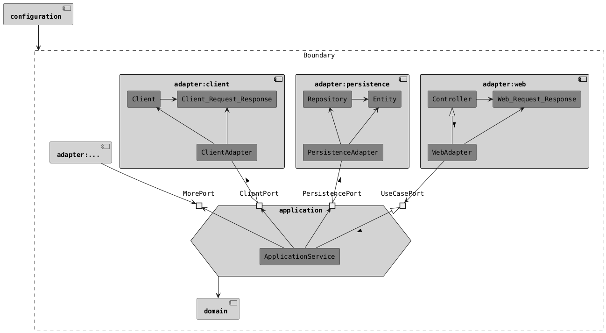

# HoCAT 🐾

HoCAT，Hands-on Clean Architecture Template，即可落地的整洁架构模板。旨在成为项目的代码库模板选项之一。

使用了当前最新的技术和工具、推荐的使用/配置方式和最佳实践。

## 项目说明

查看[HoCAT文档](.hocat)。

## 项目使用

- 前置条件
  - 安装Java 21。
  - 安装Docker和Docker Compose。

- 测试构建

  使用`./gradlew build`构建项目。

- 本地运行

  使用`./gradlew bootRun`运行本地环境。

  如果需要启动本地三方服务，运行`scripts/run-stub-runner-server configuration/src/test/resources/contracts/client 16581`

- 打包

  使用`./gradlew bootBuildImage`构建Docker镜像。这基于Spring Boot的Gradle插件。

## 技术栈

- 基础
  - Java (21 LTS)
  - Spring Boot (3.4.0)
  - Spring Bean Validation
  - Lombok
  - JUnit 5
  - AssertJ
  - Mockito
  - Docker & Docker Compose
- 构建
  - Gradle
  - JaCoCo
  - Spotless
- Web
  - Spring Web MVC
  - Spring Cloud Contract Verifier
  - Spring Security
  - Spring Cloud Contract Stub Runner (for consumer)
- Persistence
  - Spring Data JPA
  - MySQL (8 LTS)
  - Flyway
  - Spring Boot Docker Compose Support
- Client
  - Spring RestClient
  - Spring Cloud Contract Stub Runner
- 文档
  - Markdown
  - PlantUML

## 数据库

为避免端口冲突，采用动态端口，需要通过Docker Compose查看数据库端口。

- 查看自动化测试数据库

  在`adapter/persistence`目录下执行`docker compose ps`，查看`PORTS`。

- 查看本地运行数据库

  在`configuration`目录下执行`docker compose ps`，查看`PORTS`。

## 契约消费者（例如前端）自动化测试支持

运行Stub Runner Server，执行`scripts/run-stub-runner-server`。

- 使用adapter/web的契约。
- 需要使用Java 1.8或者11，不支持Java 17或更高版本。
- 默认端口是16580。

## 架构

## IDE使用

- Formatter：安装IDE插件[Spotless](https://github.com/diffplug/spotless)。

## 轻量级版本

[HoCATLing](https://github.com/macdao/hands-on-clean-architecture-template-ling)，不拆分多个独立的组件，适用于小型项目。